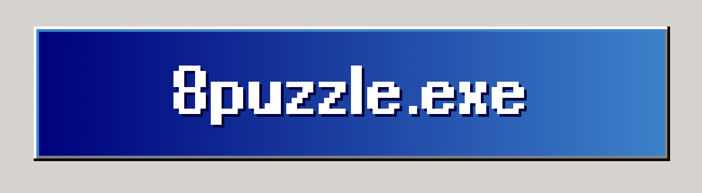
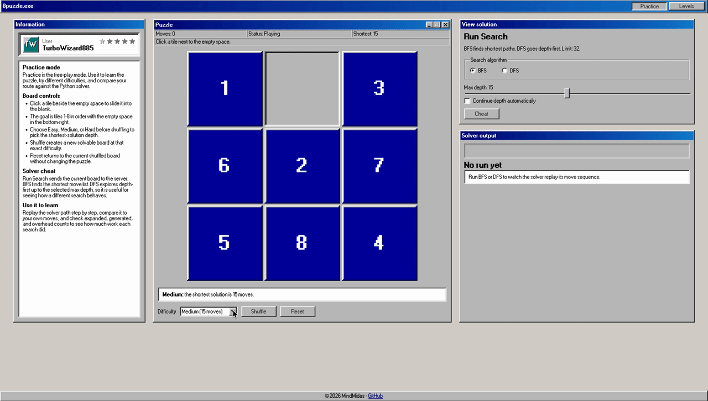

<p align="center">
  
</p>

<p align="center">
  Windows 98-style 8-puzzle game with challenges and Python BFS/DFS solver
</p>

<p align="center">
  
  
  
</p>

<p align="center">
  Challenge yourself, earn badges, or practice with BFS/DFS.
</p>

<p align="center">
  <a href="https://www.python.org/"></a>
  <a href="https://react.dev/"></a>
  <a href="https://www.typescriptlang.org/"></a>
  <a href="https://vite.dev/"></a>
  <a href="https://github.com/jdan/98.css"></a>
</p>

<p align="center">
  
</p>

## Overview

- Play an interactive 3x3 8-puzzle board in a 98.css frontend.
- Generate random easy, medium, and hard boards with exact shortest-path depths.
- Use Practice mode to shuffle, reset, solve, and replay BFS/DFS results.
- Use Levels mode to clear 15 boards, improve your best moves, and unlock badges.
- Run the original Python BFS/DFS code from the browser or CLI.

Difficulty levels:

| Difficulty | Shortest solution |
|---|---:|
| Easy | 10 moves |
| Medium | 15 moves |
| Hard | 31 moves |

Shuffle and level boards are generated from real legal moves, so every board is solvable and has a known shortest path.

Levels mode uses fixed shortest-path depths:

`4, 6, 8, 10, 12, 14, 16, 18, 20, 22, 24, 26, 28, 30, 31`

Level progress is stored in the browser. Badges reward clearing more levels and matching the shortest move count.

## Prerequisites

| Dependency | Supported version |
|---|---|
| Python | 3.10+ |
| Node.js | 20.19+, 22.13+, or 24+ |
| npm | 10+ |
| Docker and Compose | Current stable release for production |

## Quick Start

```bash
./build
```

This installs locked npm dependencies when needed, builds the frontend, and starts the local server. Then open `http://127.0.0.1:8001`.

## Locked Frontend Dependencies

| Package | Version |
|---|---:|
| React / React DOM | 19.1.0 |
| TypeScript | 6.0.3 |
| Vite | 8.0.16 |
| 98.css | 0.1.21 |

## Commands

```bash
./build build       # build TypeScript and frontend assets
./build run         # start without rebuilding
./build restart     # rebuild and restart
./build stop        # stop the local server
./build clean       # remove generated output
./build typecheck   # run TypeScript checks
./build audit       # run typecheck and npm dependency audit
./build help        # show command help
```

Set `EIGHTPUZZLE_PORT` to use a port other than `8001`.

## Deploy

**Local:** `./build` -> `http://127.0.0.1:8001`

**Production**

Set this environment variable on the server:

- `EIGHTPUZZLE_ENV=production`

```bash
docker build -t 8puzzle .
docker run -d --restart unless-stopped \
  -e EIGHTPUZZLE_ENV=production \
  -p 8020:8020 \
  8puzzle
```

Serve it through an HTTPS reverse proxy when deployed publicly.

If the app is behind a trusted reverse proxy that sets `X-Forwarded-For`, set `TRUST_PROXY_HEADERS=1`. Leave it unset for direct public hosting so clients cannot spoof their rate-limit identity.

## CLI

Run searches directly from the project root:

```bash
python3 -m src.solver.runner <algorithm> [options]
```

Algorithms:

- `bfs` runs breadth-first search.
- `dfs` runs depth-first search.
- `both` runs both and compares found solution paths.

Options:

| Option | Purpose |
|---|---|
| `-d DEPTH` | Search up to the given max depth. |
| `-c` | Continue searching after the first solution. |
| `-l` | Run 50 random boards and write aggregate results. |

Examples:

```bash
python3 -m src.solver.runner bfs -d 31
python3 -m src.solver.runner dfs -d 15
python3 -m src.solver.runner both -d 20
python3 -m src.solver.runner both -d 31 -l
```

CLI runs write `results.json`. The `-l` option also creates `50Puzzles.txt`.

## Project Map

| Path | Purpose |
|---|---|
| `src/solver/EightPuzzle.py` | 8-puzzle state model and legal move generation. |
| `src/solver/SearchProblem2.py` | Shared BFS/DFS search superclass and metrics. |
| `src/solver/runner.py` | CLI runner for BFS, DFS, and comparison runs. |
| `src/server/` | Local HTTP server, JSON API, shuffle generation, and API reference. |
| `src/frontend/src/` | React application and UI logic. |
| `src/frontend/vendor/98css/` | Vendored 98.css stylesheet, fonts, and license. |
| `src/frontend/public/assets/` | Logo, favicon, and README banner assets. |

## API Reference

- [`src/server/API.md`](src/server/API.md) documents the local JSON API.

## Credits

- UI styling uses [98.css](https://github.com/jdan/98.css), including the Windows 98 controls, fonts, and base stylesheet.

## Notes

- Max solve depth is capped at `32`.
- Hard boards use the known maximum optimal 8-puzzle depth of `31`.
- The empty tile is represented as `e` in the Python code and API.
- Levels mode keeps the solver hidden so the boards have to be cleared manually.
- Browser progress is local, while the server still validates API requests.
